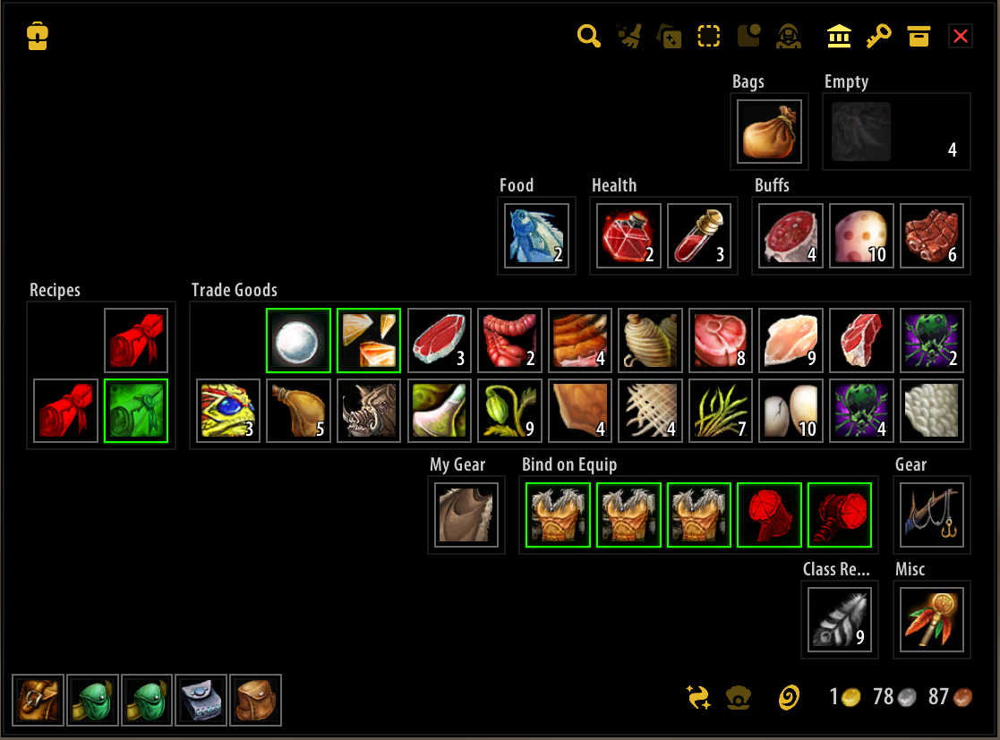
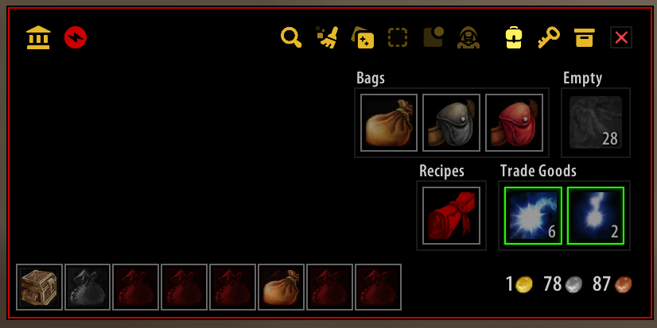

  

**Feng shui for your bags:** A Classic WOTLK WoW 3.3.5 (and Project Epoch WoW) inventory addon. Not for Retail; you have [so](https://www.curseforge.com/wow/addons/better-bags) [many](https://www.curseforge.com/wow/addons/ark-inventory) [options](https://www.curseforge.com/wow/search?class=addons&categories=bags-inventory&sortBy=popularity).

<h4><picture>
  <source media="(prefers-color-scheme: dark)" srcset="Images/Screenshot_1.png">
  
</picture>
<picture>
  <source media="(prefers-color-scheme: dark)" srcset="Images/Screenshot_2.png">
  
</picture> 

## Features

* Single window inventory for Bags, Bank, and Keyring.
* [Customizable layout and design] with automatic grouping and sorting.
* [Categorization] via [rules] and item lists.
* Per-inventory and account-wide [search].
* Offline viewing of any character’s inventory and [item counts in tooltips.
* Identification of [profession reagents and crafted items]. Updated when the crafting window is opened.
* Color tinting of unusable items.
* Badges to indicate stock changes, quality, quest items, and unusability.
* Empty slot stacking and custom graphics for profession bag slots.
* Automated bag swapping – no more manual item shuffling!
* Selling protection to safeguard valuable items.
* Clam (Open Container), Disenchant, Pick Lock, and Hearthstone buttons.
* [Colorblind mode] to help identify item quality and unusability.
* Plenty of other little niceties like item restacking, pfUI skinning, and more.

Recommended if you like…

> AdiBags, ArkInventory, Baganator, Baggins, BetterBags, EngInventory/EngBags, TBag.  
> And with “[OneBagshui]”: Bagnon, Combuctor, Inventorian, LiteBag, OneBag3, SUCC-bag.

## Documentation

⬇️ [Installation](#installation)  
🕝 [Version history](Changelog.md)

## Installation

### Easy mode (recommended)

Use [GitAddonsManager](https://woblight.gitlab.io/overview/gitaddonsmanager/).  
Or any tool that supports Git.

### Manual

1. [Download Bagshui](https://github.com/Fragglechen/Bagshui-epoch/releases/latest/download/Bagshui-epoch-1.0.0.zip
).
2. Extract the zip file.
3. Ensure the resulting folder is named `Bagshui` and rename if needed.
4. Move that folder to `[Path\To\WoW]\Interface\Addons`.
5. Ensure the structure is `Interface\Addons\Bagshui-epoch\Bagshui-epoch.toc`.  
   *These are all **wrong**:*  
    × `Bagshui-epoch\Bagshui\Bagshui.toc`  
    × `Bagshui-epoch-main\Bagshui.toc`  
    × `Bagshui\Bagshui-main\Bagshui.toc`
   

## Compatibility

### Functionality

<table>

<tr>
<td>

### Auction and Mail
Right-click/Alt+click attach

</td>
<td>

* Blizzard UI
* [aux](https://github.com/Fragglechen/aux-addon-epoch)
* [Mail](https://github.com/Fragglechen/EpochMail)

</td>
</tr>

<tr>
<td>

### Cooldown counts

</td>
<td>

* [OmniCC](https://felbite.com/addon/4773-omnicc/)
* [pfUI](https://github.com/Fragglechen/pfUI/)
* [ShaguTweaks](https://github.com/Fragglechen/ShaguTweaks/)

</td>
</tr>

<tr>
<td>

### Interface replacement

</td>
<td>

* [pfUI](https://github.com/Fragglechen/pfUI/) skin  
Manage in **pfUI Config** (`/pfui`) > **Components** > **Skins**

</td>
</tr>

<tr>
<td>

### [Rule functions]

</td>
<td>

* `Outfit()` - [ItemRack](https://github.com/Defcons/epoch-addons/releases/tag/ItemRack-v1.0) and [Outfitter](https://www.curseforge.com/wow/addons/outfitter-retrofit)
* `Wishlist()` - [AtlasLoot](https://github.com/reneas/AtlaslootProjectEpoch)

</td>
</tr>

<tr>
<td>

### T- Mog

</td>
<td>

* **Guild Bank** right-click to deposit.
* [Tmog](https://github.com/Fragglechen/Tmog-epoch).

</td>
</tr>

</table>

### Languages

If Bagshui has not been localized for your client, many items will not be correctly identified by the built-in categorization[^1]. Please consider [contributing a translation](Locale/Readme.md) if you'd like to have full functionality!

* English (enUS)
* Chinese (zhCN)

## Donations
Developing Bagshui is fun, but also a lot of work! Your support is hugely appreciated.  

## Credits

Bagshui owes [so much to so many people](Credits.md).

  
